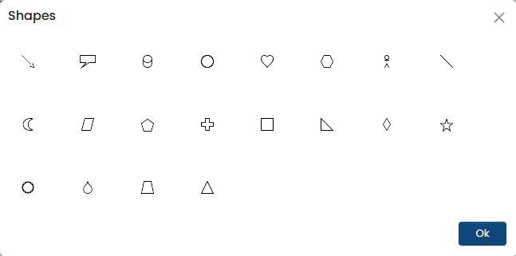

---
layout:
  width: default
  title:
    visible: true
  description:
    visible: false
  tableOfContents:
    visible: true
  outline:
    visible: false
  pagination:
    visible: true
  metadata:
    visible: false
---

# Objects and Properties

All the objects are available in the left pane.&#x20;

To insert an object, simply click it. When you do, the platform opens up its basic display properties in the **Object** tab on the header menu, as you see here.&#x20;

<figure><figcaption></figcaption></figure>

After placing the object on the canvas, use these properties to quickly adjust its look and feel.

To rename and access its properties, double-click the object on the canvas or in the Layers tab&#x20;

To view additional properties of an object, click the **Properties** tab in the right pane. \
The **Property Editor** displays the respective object properties. Set the object's properties as per your requirement.

<figure><figcaption></figcaption></figure>

### Drawing Objects

Shapes

Click to view all the shapes available along with callouts, human symbols, and more.&#x20;

<figure><figcaption></figcaption></figure>

To use a shape, select it and draw it in the template at the required position.

Interactive Shapes

Use interactive drawing objects to design actionable and user-responsive templates. These objects enable user input, selection, or interaction when the output is viewed digitally (PDF, HTML, web forms).

<figure><figcaption></figcaption></figure>

Interactive drawing objects are best suited for digital-first communications such as onboarding forms, service requests, and consent documents. They are commonly used in banking, insurance, and enterprise communications where customer confirmation, choices, or inputs are required, such as consent forms, service requests, onboarding documents, and applications.

<table><thead><tr><th width="171" valign="top">Interactive Object </th><th valign="top">When to Use</th><th valign="top">Example</th></tr></thead><tbody><tr><td valign="top">Button</td><td valign="top">Use when you want the user to perform an action</td><td valign="top">A <strong>“Submit"</strong> button in a pre-verification insurance form</td></tr><tr><td valign="top">Checkbox</td><td valign="top">Use when users can choose more than one option</td><td valign="top">Accepting terms and conditions and Opting in for notifications</td></tr><tr><td valign="top">Dropdown</td><td valign="top">Use when space is limited and the user must select one option from many</td><td valign="top">To select Account Type: Savings | Current | Credit Card | Loan</td></tr><tr><td valign="top">Element</td><td valign="top">Use elements to logically group objects or control layout structure</td><td valign="top">Grouping all KYC-related fields under one section</td></tr><tr><td valign="top">Input Field</td><td valign="top">Use when users has to provide information</td><td valign="top">Input fields to enter an insurer's details, such as Name, PAN, Aadhaar, etc.</td></tr><tr><td valign="top">Radio Button</td><td valign="top">Use radio buttons when choices are mutually exclusive</td><td valign="top">A bank sends an interactive credit card statement and asks to confirm how they prefer to receive future statements. ○ Email only ○ Physical copy by post ○ Both email and physical copy</td></tr></tbody></table>

> **Recommendations**:
>
> * Use **dropdowns** for controlled choices
> * Use **checkboxes** for acknowledgements
> * Use **input fields** only when free-form data is required

### Images

Image

The **Image** object () is used to add visual elements such as logos, icons, banners, or QR codes to a communication template.&#x20;

It is commonly used for headers with brand logos, QR codes for payments, or icons for key information.

To upload the image, double-click the object on the canvas. For a static image, use the "Browse" option, and for a dynamic image, select the data object from the listed input data.

To insert a hyperlink to the object, either use a static URL or link to a dynamic data object.

<figure><figcaption></figcaption></figure>

### Rich Text

<strong>Text</strong>

Use the **Rich Text** object (.png>)to display formatted text and embed dynamic data within a paragraph without affecting the surrounding content. It supports mixed content such as static text, variables, and basic formatting in a single block.

It is useful when you need to insert dynamic values like customer name, account number, or balance within sentences, such as in personalized banking statements or letters, while keeping the text structure intact.

### Table

<strong>Table</strong>

A **Table** object ()is used to display structured, row-and-column data in a clear and organized format. It is ideal for presenting grouped information.&#x20;

Use it when the data has a consistent structure.&#x20;

Use **the Data Association** property to map it with the complex object to insert the required data in the table.&#x20;

**Example:** Loan repayment schedules, Premium breakdowns in insurance documents, etc.

### Complex Object

<strong>Complex Object</strong>

A **Complex** object () represents a group of related data objects that repeat together as a unit. It is used when multiple fields must be rendered collectively based on input data.

Use complex objects when displaying repeating data blocks that contain multiple attributes.

**Example:** Monthly transaction blocks in credit card statements, EMI schedules grouped by account, and such other.

**Defining a complex object**: Select the object and choose the relevant XML tag (identifier) that represents the table. Map the header, body (data), and footer tags, and define the required rows and columns to align with the input data.

You can view all created complex objects under **Data Mapper > RAW > Input > Complex**.

Each new complex object is created with an incremental index. To rename a complex object, clickand enter a unique name for easy identification.&#x20;

<figure><figcaption></figcaption></figure>

For more information, [click here](../template-management/creating-a-template/working-with-complex-objects.md)

### Visualization Objects

<strong>Charts</strong>

A **Chart** object help you present numeric data visually inside a communication template. Commonly used in statements, summaries, and reports to make trends and comparisons easy to understand.

Use charts when you want to include visual insights in a template.&#x20;

**Example:** Spending category breakdowns, month-wise balance trends, and others.

To use the chart object,&#x20;

* Point your cursor at the desired position in the template and click  in the left pane.&#x20;
*   Select the chart type (line chart, bar chart, pie chart, donut, or dual chart) and select the chart sub type, if applicable. As you select, it gives an instant preview. 

    
<figure><figcaption></figcaption></figure>

* Next, use **Data Association** to map the chart to actual data and control what and how it should display. To map,&#x20;
  * Click **Data Association** (). Expand the chart and click '+' to add actions. &#x20;
  * Next, under the legend, click  and select the source object and element.
  * Select the legend color and make "Show Points" to 'True', to make it visible.
* Then, select the chart output type and set each property (Legends, Title, X-axis/Y-axis labels) to define how it should appear in the template.

<figure><figcaption></figcaption></figure>

<strong>Barcodes</strong>

The **Barcode** object is used to add scannable codes to a template for identification, tracking, or payment processing.

Use barcodes when documents need to be scanned or tracked.

**Example:** Document tracking IDs, Branch or account identifiers, and more.

**Using a Barcode**: To add a bar code,&#x20;

* Click  in the left pane, an object appears on the canvas.
* Double-click it to configure. The settings here allow precise control over how the barcode appears and behaves in the final output.\
  **General** - Select the barcode type from the available list of categories.

<strong>Frame</strong>

A **Frame** object is used to group and hold multiple objects together within a defined boundary. It helps organize the layout and maintain alignment of related elements.

Frames are useful when you want to move, resize, or control a set of objects as a single unit. Use a frame when multiple elements must stay together and follow the same layout rules.

**Example**: Grouping account summary fields in bank statements, holding customer address blocks, etc.

**Using a Frame**: Select the object in the left pane and draw it in the required position on the canvas. Every time you add a frame, it is referred as Frame1, Frame2, and so on. Double-click it to give it a meaningful name and define its presence within the template and while processing.&#x20;

Map it to a global template by specifying the template, group, page, and layer.\
\
To set its position and appearance, access its properties in the property editor.

<figure><figcaption></figcaption></figure>

