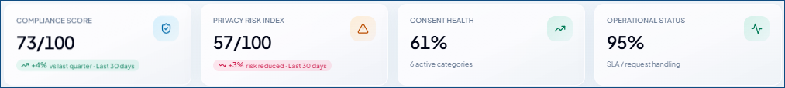

---
layout:
  width: default
  title:
    visible: true
  description:
    visible: false
  tableOfContents:
    visible: true
  outline:
    visible: false
  pagination:
    visible: true
  metadata:
    visible: false
  tags:
    visible: true
  actions:
    visible: false
---

# Executive Dashboard

The **Executive Dashboard** provides leadership users with a consolidated view of the organization's privacy, compliance, consent, risk, and operational status. It brings key performance indicators, trends, alerts, and risk insights together in a single dashboard, helping users understand the current state of privacy operations and identify areas that may require attention.

The dashboard also provides filtering and personalization options so users can focus on specific business areas, departments, consent categories, processing purposes, customer segments, or time periods. Users can review detailed trends and summaries, export or share dashboard information, and use the **AI Assistant** to receive prioritized recommendations based on the current privacy posture.

To view this dashboard, go to **Dashboard** > **Executive Dashboard**.

<figure><figcaption></figcaption></figure>

Let's look at each section in this dashboard.

<strong>Key Performance Indicators</strong>

These indicators help users quickly identify areas that are performing well and areas that may require further review for the selected timeframe:

* **Compliance Score** – Indicates the current compliance score based on the dashboard's compliance metrics.
* **Privacy Risk Index** – Indicates the current level of privacy risk represented in the dashboard.
* **Consent Health** – Provides an overview of the current state of consent, including active consent categories.
* **Operational Status** – Shows the current operational performance, including request-handling or SLA-related metrics.

<figure><figcaption></figcaption></figure>

<strong>Executive Summary</strong>

This provides a concise interpretation of key privacy and compliance indicators for the selected period, highlighting changes in compliance and risk scores, consent health, integrations, data protection activities, and other significant areas.

<figure><figcaption></figcaption></figure>

<strong>Executive Alerts</strong>

This section highlights events that may require leadership attention. Alerts are categorized by priority, such as **Critical**, **High**, **Medium**, or **Info**. This helps you identify issues such as pending assessments, inactive consent categories, high-risk processing activities, or other conditions that may affect privacy operations.

<figure><figcaption></figcaption></figure>

<strong>Compliance Trend</strong>

The **Compliance Trend** chart shows how the compliance score changes over the selected period.

This even displays a **Maturity score** to show how your organization's compliance posture has changed over the selected period. A **higher score** generally indicates that more privacy and compliance practices are established and operating effectively, while a **lower score** indicates areas where controls or processes may need improvement.

<figure><figcaption></figcaption></figure>

<strong>Privacy Risk Trend</strong>

The **Privacy Risk Trend** chart shows changes in the privacy risk indicator over time.

This helps you monitor changes in risk levels and identify periods where privacy risk increases or decreases.

<figure><figcaption></figcaption></figure>

<strong>Consent Health</strong>

The **Consent Health** chart provides a visual comparison of consent that has been **granted** and **withdrawn** over time.&#x20;

This helps you understand consent trends and monitor changes in customer consent behavior.

<figure><figcaption></figcaption></figure>

<strong>Privacy Requests</strong>

The **Privacy Requests** chart provides an overview of privacy requests based on their processing status, such as [**Completed**](#user-content-fn-1)[^1], [**Pending**](#user-content-fn-2)[^2], and [**Overdue**](#user-content-fn-3)[^3]. It helps you monitor request volumes and identify requests that may require attention during the selected period.

The data is grouped by week within the selected date range. For example, when the default "Last 30 days" period is selected, the data is presented week-wise. Each week represents a seven-day period starting from the beginning of the selected date range.

<figure><figcaption></figcaption></figure>

<strong>Privacy Risk Heatmap</strong>

The **Privacy Risk Heatmap** provides a visual representation of privacy risk across different areas, such as ROPA, DPIA, Consent, Partners, Integrations, and Operations.&#x20;

This is presented using a risk-severity scale, where the colors progress from lower to higher risk. This helps you quickly identify areas with higher risk and prioritize them for further review or action.

<figure><figcaption></figcaption></figure>

<strong>Breach Overview</strong>

**Breach Overview** provides a summary of recorded privacy breaches and their current status. It displays the number of breaches that are '**Open'**, '**Under Investigation'**, and \
'**Closed YTD'**, helping you monitor breach activity and track the current status of reported breaches.

<figure><figcaption></figcaption></figure>

<strong>Policy Compliance</strong>

The **Privacy Compliance** widget provides an overview of policy acknowledgment status, including **Acknowledged**, **Pending**, and **Overdue** items. This information helps you monitor policy compliance and identify items that may require follow-up.

<figure><figcaption></figcaption></figure>

### Dashboard actions

The dashboard provides several actions that help you work with the displayed information:

* Turn ON **Auto-refresh** to automatically update the dashboard data. If disabled, select **Refresh** manually to load the latest dashboard data.
* Select **Export** and choose the format (PDF/Excel) to make available the dashboard data offline for further analysis or reporting. The platform downloads it to your default local storage.
* Select **Share** to share the dashboard link with other users.
* Use **Bookmark** action to save the dashboard for quick access.
* Use **Fullscreen** action to expand the dashboard to use the available screen area (full screen).
* Use [**AI Assistant**](executive-dashboard.md#ai-assistant) to get the AI-powered recommendations for the current dashboard metrics.

### AI Assistant

The **AI Assistant** provides prioritized recommendations based on the organization's current privacy posture. When enabled, it uses the information available in the dashboard to highlight areas that may require attention and presents suggested actions.

Recommendations can be categorized based on their priority and area of focus, such as:

* **Executive Action** – Highlights issues that may require leadership attention.
* **Consent** – Identifies consent-related conditions that may require action.
* **Operations** – Highlights operational conditions and potential opportunities for preventive action.

Each recommendation provides an identified condition and a suggested action.&#x20;

For example, the AI Assistant may highlight incomplete DPIA assessments as a critical executive action, identify inactive marketing consent as an area requiring attention, or recommend preventive operational measures when request volumes are expected to increase.

<figure><figcaption></figcaption></figure>

[^1]: Requests completed during that week

[^2]: Requests still pending during that week.

[^3]: 
