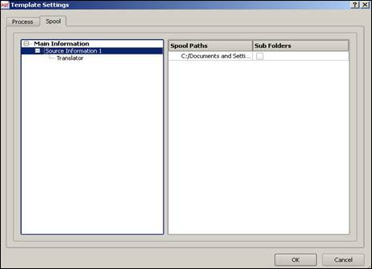

---
layout:
  width: default
  title:
    visible: true
  description:
    visible: false
  tableOfContents:
    visible: true
  outline:
    visible: false
  pagination:
    visible: true
  metadata:
    visible: false
  tags:
    visible: true
---

# Multi-Processing Templates

Multi-processing allows multiple processors (workers) to process the same template simultaneously. This approach distributes the workload across processors, reducing the processing time when handling large volumes of data.

In this setup:

* A **Multi-Processing Template (MPT)** defines how many processors and workers are used.
* Each processor handles a portion of the processing workload.
* Processing runs in parallel to improve throughput.

For instance, if a template processes a large batch of communication records, multiple workers can process different records simultaneously.

### Creating a Multi-Processing Template

The Process Manager controls how templates are processed within the system.

Administrators can configure **MPTs** and assign processors to templates for different processing modes:

* User Process
* Daemon Process
* Scheduled Process

These configurations determine how template processing workloads are distributed across available system resources.

Before creating an MPT, ensure the following:

* The template must be active and available on the server. \
  ([Click here](../all-about-templates/template-design-and-management/version-control.md) to understand how to add a template to version control)
*   The template must be mapped to a spool path for processing. To map,

    * In **Template Designer**, open the **Tools** menu.
    * Select **Template Settings**. Alternatively, press <kbd><mark style="color:$primary;">CTRL+ALT+D<mark style="color:$primary;"></kbd>.
    * Select the **Spool** tab and configure the required spool path for the template.

    
<figure><figcaption></figcaption></figure>

* Required processors must be available.

### Configuring MPTs for User and Daemon Process

Configuring MPT for User Process

### Configuring MPT for User Process

To create an MPT,

* Select the **IP address** of the current system where processing will run.
* Under the **Process** field, right-click the IP address and select **Configure**. \
  The **Process Configuration** dialog appears.
* Under the **Process Management**, select **User Process**. The available processors appear in the right pane.
*   Select the required processor(s) and enter the number of workers for selected processor(s).\
    (Workers define the number of parallel processing instances) 

    
<figure><figcaption></figcaption></figure>


Based on the processors to be used during processing the template, the same must be enabled in the **Use** field.&#x20;


* Right-click **User Process** and select **Create**. The **Create Multi-Processing Template** dialog box appears.
*   Enter the **Template Name** and **Description**. Then, click **OK**. 

    
<figure><figcaption></figcaption></figure>

* The template is created and appears under "User Process" in the **Process Configuration** dialog.&#x20;
*   Click the created MPT and assign Processors. Then, click **Upload**. 

    
<figure><figcaption></figcaption></figure>

The template configuration is uploaded to the server. You can now use the MPT for batch processing.

To modify processor settings, right-click it and set the processor count as required.&#x20;

To remove an MPT, right-click it and select **Remove**.


The processor count depends on the number of processors available on the system.


Configuring MPT for Daemon Process

### Configuring MPT for Daemon Process

A daemon process runs continuously in the background to process templates automatically.

To configure an MPT to run in Daemon Process, first create an MPT.

To create an MPT,

* Select the **IP address** of the current system where processing will run.
*   Under the **Process** field, right-click the **IP address** and select **Configure**. \
    The **Process Configuration** dialog appears. 

    
<figure><figcaption></figcaption></figure>

* Under the **Process Management**, select **Daemon Process**. The available processors appear in the right pane.
* Select the required processor(s) and enter the number of workers for selected processor(s).\
  (Workers define the number of parallel processing instances)


Based on the processors to be used during processing the template, the same must be enabled in the **Use** field.&#x20;


* Right-click **Daemon Process** and select **Create**. The **Create Multi-Processing Template** dialog box appears.
*   Enter the **Template Name** and **Description**. Then, click **OK**. 

    
<figure><figcaption></figcaption></figure>

The template is created and listed under **Daemon Process**.

To select an MPT for processing,

* Select Daemon Process and select the template to process from the drop-down list.
*   Specify the maximum number of processing instances. Set this value to '**0'**, to allow unlimited processing instances. 

    
<figure><figcaption></figcaption></figure>

Select **Upload** and then select **Ok**.

The template configuration is uploaded to the server. You can now use the MPT for batch processing.

To modify processor settings, right-click it and set the processor count as required.&#x20;

To remove an MPT, right-click it and select **Remove**.


The processor count depends on the number of processors available on the system.


The process configuration includes Primary and Secondary clients, as defined in the Environment Configuration. While creating a configuration, specify the template name, description, and select the template from the server template list.


**Users with permissions to manage MPTs can only access and configure.**

