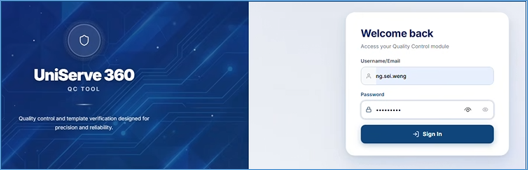

---
layout:
  width: default
  title:
    visible: true
  description:
    visible: false
  tableOfContents:
    visible: true
  outline:
    visible: false
  pagination:
    visible: true
  metadata:
    visible: false
  tags:
    visible: true
  actions:
    visible: true
---

# Approval/Rejection Process

### Logging into QC Module

* Launch the browser and hit this URL: [https://\<uniserve360\_url>/qc/](https://172.16.1.95:8443/qc/)
* Log in to the module, choose the role, and select Continue.

<div align="left" data-with-frame="true"><figure><figcaption></figcaption></figure></div>

<div align="left" data-with-frame="true"><figure><figcaption></figcaption></figure></div>

The QC module directs you to the dashboard page.

> * The idle time for an authenticated session is 30 min (configurable).
> * While an active session is running, the application prevents users from opening or accessing the same module in a new window or browser tab.

### Dashboard

The Dashboard provides a consolidated view of communication records awaiting review and helps approvers quickly monitor the status of communications in the QC workflow. The summary cards at the top display the overall status of communication records:

* **Pending Records**: Communications that are awaiting review and approval.
* **Completed Records** – Communications that have been reviewed and approved.
* **Rejected Records** – Communications that were rejected.

These metrics help you understand the current review workload and approval progress at a glance.

#### **QC Inbox**

The QC Inbox displays all available letters that contain communication records for review in this hierarchical structure:

```
Letter
   └── Processing Date
            └── Records
```

A letter contains multiple communication records generated on different dates. Expanding a letter displays the available dates and the associated records for review.

For e.g., consider an insurance company sending policy renewal notices. A single letter may contain multiple records generated across different dates

```
Policy Renewal Notice (Letter)
   ├── 10-May-2026 (Date)
   │      ├── Record 1
   │      ├── Record 2
   │      └── Record 3
   │
   └── 11-May-2026
          ├── Record 1
          └── Record 2
```

**View Records**

To view records,

*   In the QC Inbox, select the letter name or search for the required one and expand it. Dates on which the documents are generated are displayed.<br>

    <div align="left" data-with-frame="true"><figure><figcaption></figcaption></figure></div>
*   Click the date or select **View** button to view the records generated on that date.<br>

    <div align="left" data-with-frame="true"><figure><figcaption></figcaption></figure></div>
*   Expand the Record ID to view the generated documents that are pending for approval, for each distribution channel configured for that communication.<br>

    <div align="left" data-with-frame="true"><figure><figcaption></figcaption></figure></div>

The default status for every record will be ‘PENDING REVIEW’.

Depending on your permissions, you can:

* View the communication and attachments.
* Download the communication to verify customer-specific information and validate content and formatting.

To preview the record for any channel, select **Content view** (.png>)). It displays the email content as shown in following illustrations:

< IMAGE>

> The ‘Content view’ option is disabled for the records generated for ‘Print’ channel.

To view the document, select **Document view** (.png>)).

To download the document, select **Download document** (.png>)). \
For email, the document along with email content is downloaded as a zip file to your default local storage. Unzip or extract them to view the document.

#### Approve or Reject

After completing the review, if the communication satisfies all review requirements,

* Select **Approve** (.png>))
* Provide approval notes, then, select **Confirm** on the confirmation pop-up.\
  \
  \
  The record status changes to ‘_Approved_’.
* Select **Reject** (.png>))if corrections are required.&#x20;
* Provide the rejection reasons and select **Confirm**.\
  \
  \
  The record status changes to ‘_Rejected_’.

#### Bulk Approval/Rejection

This feature reduces manual effort when all records in a batch require the same review outcome.

Use Bulk Approval to approve or reject all records in the current review batch in a single action.

After validating the batch, select **Approve All** or **Reject All**, enter the appropriate reason, and confirm the action.

The QC Module follows a hierarchical structure to simplify navigation.

**Bulk Search**

For high-volume communication reviews, the QC Module supports bulk actions.

Instead of searching for documents one at a time, you can now upload a CSV file containing multiple policy or proposal numbers and retrieve all matching records in a single operation.

To perform bulk search,

* In the dashboard, select **Bulk search** (.png>)) and select **Download Template**, to download the sample file.
*   Fill the downloaded CSV with the required data and upload it.<br>

    <div align="left" data-with-frame="true"><figure><figcaption></figcaption></figure></div>
